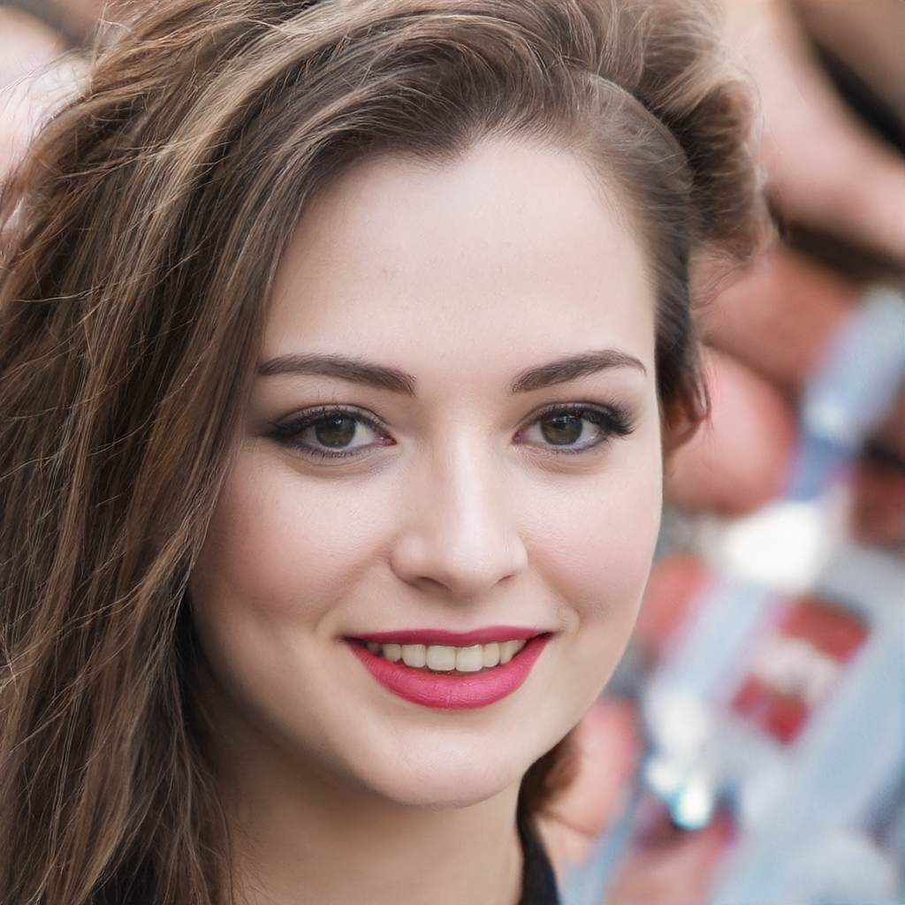
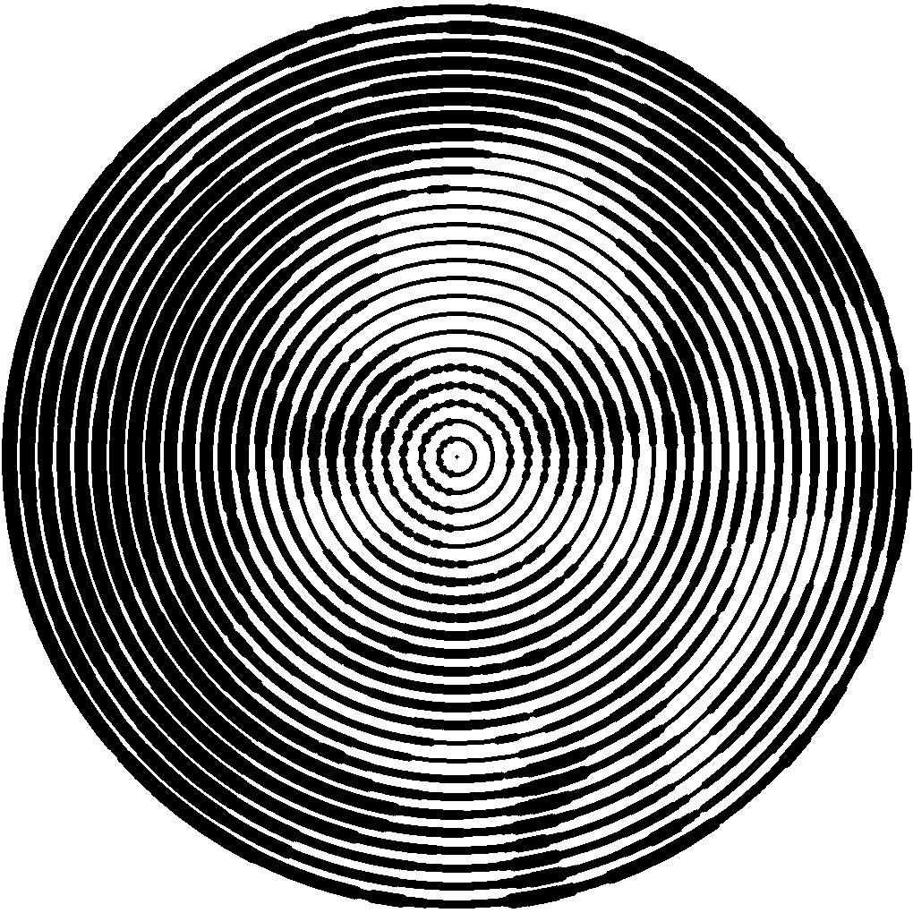
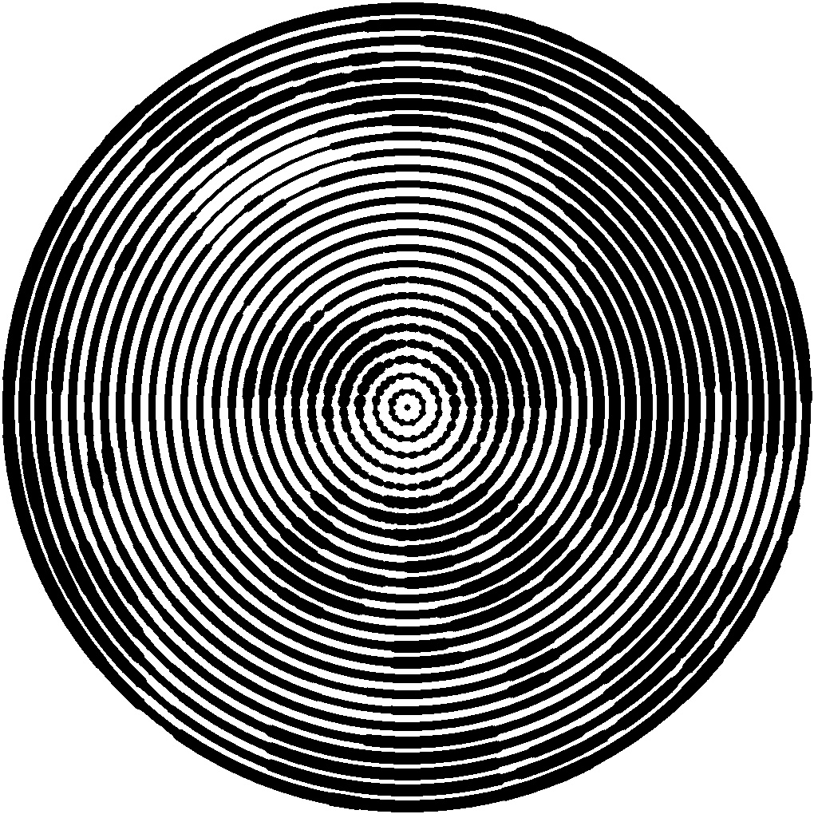

# Magical_Photo_Creator

This is a lockscreen photo creater. Takes RGB input and and return black&white output that looks like meaningless circles. But when you blur these circles it turns to original image.

Main purpose of these images is using on iPhone's lockscreen. When you slide the menu bottom to up, your lockscreen will be blured. So, you will we thhe magic :)

Here is some examples:

